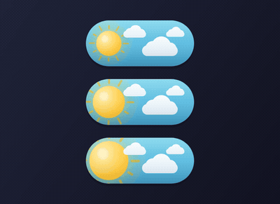
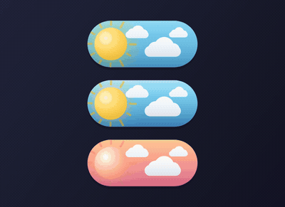
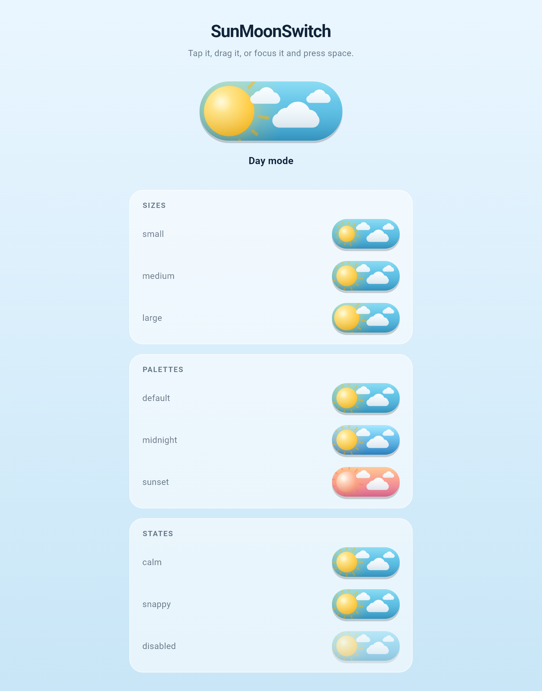
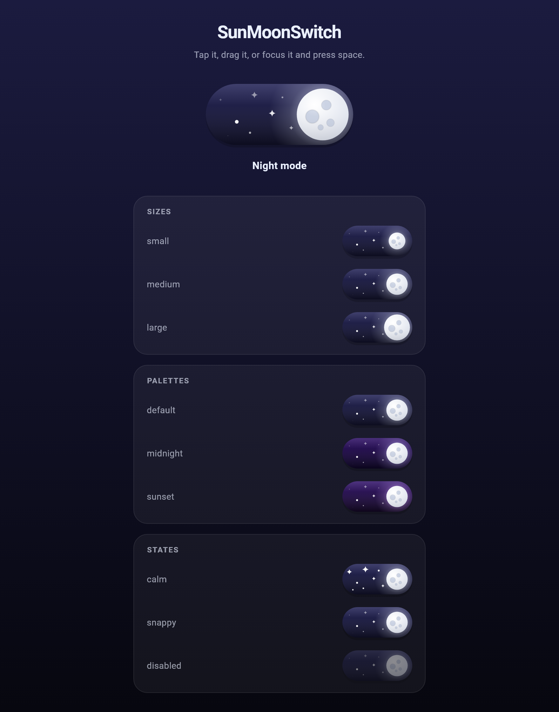

<h1 align="center">SunMoonSwitch</h1>

<p align="center">
  An animated day/night toggle for Flutter. The sun sits in a blue sky with clouds
  drifting past; flip it and the sky turns to night, stars fade in and the sun becomes
  a cratered moon.
</p>

<p align="center">
  <a href="https://pub.dev/packages/sun_moon_switch"></a>
  <a href="https://pub.dev/packages/sun_moon_switch/score"></a>
  <a href="https://pub.dev/packages/sun_moon_switch"></a>
  <a href="LICENSE"></a>
</p>

<p align="center">
  
</p>

## What you get

- One `CustomPainter`. No image assets, no dependencies beyond Flutter, sharp at any size.
- Idle motion: stars twinkle, clouds drift, the sun's rays turn, and a meteor crosses the
  night sky once per cycle.
- Drag the orb and it tracks your finger exactly, squashing while you hold it. A quick
  flick counts even before the midpoint.
- Screen reader labels, keyboard focus and activation, and automatic reduce-motion support.

## Requirements

| Requirement | Minimum |
|---|---|
| Flutter | 3.27.0 |
| Dart | 3.6.0 |

## Supported platforms

| Android | iOS | Web | macOS | Windows | Linux |
|:---:|:---:|:---:|:---:|:---:|:---:|
| ✅ | ✅ | ✅ | ✅ | ✅ | ✅ |

There is no platform-specific code, so it runs anywhere Flutter runs.

## Install

```bash
flutter pub add sun_moon_switch
```

```dart
import 'package:sun_moon_switch/sun_moon_switch.dart';
```

## Usage

`SunMoonSwitch` is controlled, like Flutter's own `Switch`. It holds no state of its own,
so give it a `value` and pass a new one back from `onChanged`.

```dart
bool _isDark = false;

SunMoonSwitch(
  value: _isDark,
  onChanged: (bool isDark) => setState(() => _isDark = isDark),
)
```

### Toggling your app theme

```dart
class MyApp extends StatefulWidget {
  const MyApp({super.key});

  @override
  State<MyApp> createState() => _MyAppState();
}

class _MyAppState extends State<MyApp> {
  bool _isDark = false;

  @override
  Widget build(BuildContext context) {
    return MaterialApp(
      themeMode: _isDark ? ThemeMode.dark : ThemeMode.light,
      theme: ThemeData.light(),
      darkTheme: ThemeData.dark(),
      home: Scaffold(
        body: Center(
          child: SunMoonSwitch(
            value: _isDark,
            onChanged: (bool isDark) => setState(() => _isDark = isDark),
          ),
        ),
      ),
    );
  }
}
```

### Sizes



The orb is sized as a fraction of the track height, so the presets hold up whatever
dimensions you pick.

```dart
SunMoonSwitch(
  value: _isDark,
  onChanged: _set,
  thumbSize: SunMoonSwitchSize.large,
  width: 160,
  height: 68,
)
```

| Preset | Ratio | Looks like |
|---|---|---|
| `small` | 55 % | Compact orb, plenty of open sky |
| `medium` | 70 % | The default |
| `large` | 85 % | Bold orb filling the track |

<br clear="right">

### Colors



Every color is a parameter. Start from the defaults and override only what you need.

```dart
SunMoonSwitch(
  value: _isDark,
  onChanged: _set,
  colors: const SunMoonSwitchColors(
    daySkyTop: Color(0xFFFFC48C),
    daySkyBottom: Color(0xFFF2709C),
    nightSkyTop: Color(0xFF3A1C71),
    nightSkyBottom: Color(0xFF10061F),
    sunEdge: Color(0xFFFF7B54),
    moonGlow: Color(0xFFD3A4FF),
  ),
)
```

`SunMoonSwitchColors.midnight` is a second ready-made palette. `copyWith` and `lerp` are
there for deriving or animating your own.

<br clear="right">

### Dragging


While you drag, the orb tracks your finger one to one with no easing in between. Let go
past the midpoint and it commits. Flick it and the fling wins, even from a standstill on
the wrong side.

<br clear="right">

## API

### `SunMoonSwitch`

| Property | Type | Default | Description |
|---|---|---|---|
| `value` | `bool` | required | `true` is night/moon, `false` is day/sun |
| `onChanged` | `ValueChanged<bool>?` | required | Called with the new value. `null` disables the switch |
| `thumbSize` | `SunMoonSwitchSize` | `medium` | Orb diameter preset |
| `width` | `double` | `110.0` | Track width |
| `height` | `double` | `48.0` | Track height |
| `duration` | `Duration` | `600ms` | Toggle animation length |
| `curve` | `Curve` | `SunMoonSwitch.defaultCurve` | Toggle curve. Overshoot is supported |
| `colors` | `SunMoonSwitchColors` | `.defaults` | Full palette |
| `animateAmbient` | `bool` | `true` | Twinkle, drift, rays and meteors |
| `ambientDuration` | `Duration` | `8s` | Length of one idle-motion cycle |
| `enableFeedback` | `bool` | `true` | Haptics on Android and iOS |
| `focusNode` | `FocusNode?` | `null` | Keyboard focus control |
| `autofocus` | `bool` | `false` | Take focus when first shown |
| `semanticLabel` | `String?` | `'Dark mode'` | What screen readers announce |

### `SunMoonSwitchColors`

`daySkyTop`, `daySkyBottom`, `nightSkyTop`, `nightSkyBottom`, `sunCore`, `sunEdge`,
`sunGlow`, `moonCore`, `moonEdge`, `moonGlow`, `crater`, `star`, `cloud`, plus
`SunMoonSwitchColors.defaults`, `.midnight`, `copyWith()` and `lerp()`.

## If you write widget tests

Idle motion loops forever, the same way `LinearProgressIndicator` does, so
`pumpAndSettle()` will time out on any screen holding a `SunMoonSwitch`. Pump fixed
durations instead:

```dart
await tester.pump(const Duration(milliseconds: 700));
```

Or turn the idle motion off for the test:

```dart
SunMoonSwitch(value: false, onChanged: _set, animateAmbient: false)
```

## Example

<p align="center">
  
  
</p>

```bash
cd example
flutter run
```

## Ideas, bugs, questions

If something is missing, broken, or just annoying, say so. Bug reports, questions and
ideas all go to [GitHub issues](https://github.com/Adrianogba/sun_moon_switch/issues);
there is a template for each.

New palettes, extra animation touches, or knobs you need exposed are all fair game. Most
of the widget is one painter, so small additions are usually easy.

Sending a pull request? Run these first:

```bash
dart format .
flutter analyze
flutter test
```

The README animations are generated rather than screen-recorded. See [`tool/`](tool/) for
the frame recorder and the ffmpeg script that stitches the GIFs.

## Support the package

This is free and MIT licensed, and it stays that way. If it saved you an afternoon and you
feel like giving something back:

<p align="center">
  <a href="https://github.com/sponsors/Adrianogba"></a>
</p>

Starring the repo and reporting bugs helps just as much.

## License

MIT. See [LICENSE](LICENSE).
